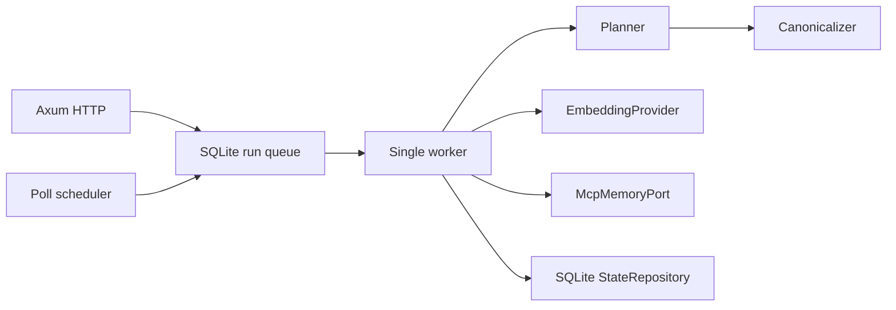
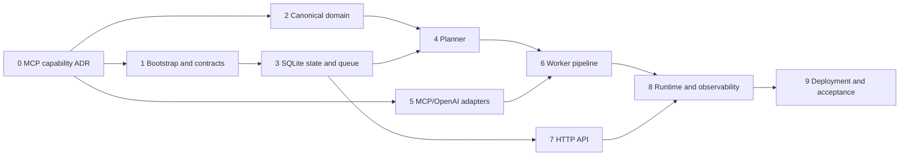

# Second Brain Indexer — low-level design v0.1

**Status:** T0 discovery complete; constrained V1 selected: entity names are the only identity and vector address, with no in-indexer generations.  
**Companion:** [technical specification](./second-brain-indexer-spec-v0.1.md).  
**Scope:** greenfield Rust service which implements spec V1 without owning Second Brain data.

## 1. Executive decision

Build a single Rust binary with a transport-free domain core and replaceable adapters for MCP, OpenAI, SQLite, HTTP, time and process locking. A single durable worker serializes graph-to-vector reconciliation; HTTP handlers only validate and enqueue work.

This preserves the spec's most important crash invariant: a vector write may be replayed, but state is marked indexed only after the MCP write succeeds.



## 2. Architecture and ownership

| Layer | Rust modules / crates | Owns | Must not know |
|---|---|---|---|
| Domain | `domain::{model, canonical, planner, retry}` | typed values, pure canonicalization, plans and state transitions | HTTP, SQL, JSON-RPC, secrets |
| Application | `application::{enqueue, execute_run, recovery}` | use-case orchestration and port calls | Axum/SQLx/reqwest details |
| Adapters | `adapters::{sqlite, mcp, openai, lock}` | external I/O and DTO translation | business selection rules |
| Delivery | `http`, `runtime::{scheduler, shutdown, bootstrap}` | endpoints, signals, runtime wiring | canonical formatting or SQL |

Start as one package with these modules. Split into workspace crates only when an adapter becomes independently reusable; a workspace now would add build complexity without a consumer.

### Port contracts

```rust
#[async_trait::async_trait]
pub trait McpMemoryPort: Send + Sync {
    async fn read_graph(&self) -> Result<GraphSnapshot, McpError>;
    async fn upsert_batch(&self, items: &[VectorWrite]) -> Result<BatchWriteResult, McpError>;
    async fn delete(&self, address: &VectorAddress) -> Result<(), McpError>;
}

#[async_trait::async_trait]
pub trait EmbeddingProvider: Send + Sync {
    async fn embed(&self, inputs: &[CanonicalDocument]) -> Result<Vec<Embedding>, EmbeddingError>;
}

#[async_trait::async_trait]
pub trait StateRepository: Send + Sync {
    async fn enqueue(&self, request: EnqueueRequest) -> Result<EnqueueOutcome, StateError>;
    async fn claim_next(&self, now: DateTime<Utc>) -> Result<Option<ClaimedRun>, StateError>;
    async fn apply(&self, transition: StateTransition) -> Result<(), StateError>;
}
```

`GraphSnapshot` always carries the readable entities and relations, plus `DeletionProof::{Complete, Unproven(reason)}`. Only `Complete && selector == Full` may produce deletion work; an unproven graph remains eligible for non-destructive upserts. The adapter must never infer `Complete` from an unpaginated response: it needs an explicit target-server proof. `VectorAddress` is exactly `EntityName`, the name-addressed contract measured in T0.

### Domain types

Use newtypes for `EntityName`, `RunId`, `ContentHash`, `TaxonomyVersion`, `RepresentationVersion`, and `IdempotencyKey`. Model selectors as a closed enum:

```rust
pub enum Selector { Full, Entity(EntityName), EntityType(EntityType) }
```

Use enums for all persisted statuses and error classes; decode external JSON at the adapter boundary with `serde` validation. Application code receives no `serde_json::Value`, raw IDs, or untyped SQL strings.

## 3. Reconciliation algorithm

1. Claim one durable run under a lease; no second worker can claim it.
2. Read one graph snapshot. Reject it as retryable if it contains an empty or duplicate exact entity name. Preserve an unproven deletion status while continuing non-destructive reconciliation.
3. Apply the selector locally, canonicalize each selected entity, and calculate SHA-256.
4. Compare with `entity_index_state`, keyed by entity name. Emit `Skip` for equal indexed hashes and `Upsert` otherwise.
5. For a `Full` snapshot with explicit complete-read proof only, emit `Delete` for previously indexed, unseen names.
6. Mark work `indexing` in SQLite. For each embedding batch: call OpenAI, require one result per input and the configured dimension for every vector, then write MCP. Commit successful entity state atomically only after MCP succeeds.
7. On a partial MCP failure, split the failed subset until a single item identifies the permanent fault; retain successful state transitions.
8. Finalize the run as `succeeded`, `partial`, or `failed`; release the lease. Retried work has a new scheduled attempt, never a blocked HTTP request.

The canonicalizer is pure. It takes a normalized `GraphEntity` plus representation settings and returns `CanonicalDocument { text, sha256 }`. Every interpolated value is JSON-string escaped after NFC/newline normalization, so embedded delimiters cannot collide. Relations render their counterpart as exact `EntityType: EntityName`; V1 has no target ID.

## 4. Required schema corrections

The supplied schema is a useful manifest but cannot yet implement the constrained V1 durable queue. Generation tables and generation-specific constraints are intentionally absent: the target MCP exposes only one mutable vector per exact entity name.

| Gap | Change | Check that makes the gate executable |
|---|---|---|
| `run` is not a queue | Add `queue_state`, `not_before`, `lease_owner`, `lease_epoch`, `lease_expires_at`, `coalesced_into_run_id` and `run_work(run_id, entity_name, action, content_hash, attempt_count, status, last_error)`. | Crash-recovery test expires a lease and exactly one new worker claims work. |
| Deletion needs a durable vector identity and complete-read proof | Store `vector_address` in `entity_index_state`; persist `run_snapshot` and `deletion_audit`, with a SQLite trigger rejecting delete work unless the run is `Full` with a complete snapshot. | Repository test rejects the unsafe insert and records the safe deletion audit. |
| Idempotency response can age independently | Store `created_at` and prune expired keys transactionally before lookup/insert. | Test same key/body reuses a run before TTL and creates one after TTL. |

SQLite operations which claim runs, coalesce requests, or change entity state must use `BEGIN IMMEDIATE` and explicit affected-row checks. Configure WAL, foreign keys, busy timeout, 0600 database, and 0700 parent directory as specified.

## 5. Generation and MCP gate — do this first

The spec requires no mixed vector models/dimensions in one active generation, but it does not prove that `mcp-memory` exposes namespaces, metadata filters, collection names, or versioned vector keys. SQLite cannot enforce isolation inside MCP's vector store.

**Hard gate:** do not implement destructive full reindexing until a target-instance probe proves one of these contracts:

1. vector operations accept a generation/collection/namespace and retrieval uses it; or
2. vector IDs are caller-provided and can be versioned as `generation_id/entity_id`; or
3. the MCP owner explicitly approves an atomic replacement strategy.

Also probe and record: transport negotiation; `read_graph` complete-snapshot semantics; graph JSON; stable IDs; batch maximum; per-item result/error shape; upsert idempotency; deletion name/semantics; and whether `entity`/`entityType` can be server-selected. This task produces checked-in captured fixtures and an ADR, not assumptions.

Suggested gate command, once target transport details are configured (same command in fish and bash):

```text
second-brain-indexer probe-mcp --config ./config/local.toml --write-report docs/adr/0001-mcp-contract.md
```

The command must fail non-zero when any required capability is absent; its report records redacted request/response shapes and limits. No “vector delete” placeholder reaches production code.

### T0 result — target endpoint, 2026-09-04

The read-only probe completed against the supplied target instance. It negotiated MCP `2025-03-26` over Streamable HTTP/SSE with `mcp-memory` `5.2.1`; `notifications/initialized` returned `202` and `tools/list` returned `200`. No credential, graph contents, or vector data were retained in this repository.

| Required contract | Measured result | Consequence |
|---|---|---|
| Stable entity ID | **Absent.** `read_graph` entities expose only `name`, `entityType`, and `observations`; relations expose only `from`, `relationType`, and `to`. | The specification's `entity_id` key cannot be implemented. Name is unique and case-sensitive according to the server instructions, but is not an immutable ID. |
| Complete graph response | `read_graph({})` returned 253 entities and 321 relations in one response. Its schema exposes optional `offset`/`limit`, but no completeness marker or snapshot version. | A no-pagination response can be treated as complete only after the adapter verifies the response is not truncated; safe deletion still needs an explicit server contract or a conservative no-delete fallback. |
| Vector writes/deletion | `vector_batch_upsert` exists (max 1024, item-level errors); `vector_upsert_embedding` and `vector_delete_embedding` exist. | The basic incremental write/delete pipeline is feasible. |
| Dimensions | `vector_store_stats` reported `dims: 384`, `embeddingCount: 0`, index `hnsw`; the vector tools require their configured dimension. | The specification's default 1536 is incompatible with this target. Do not send `text-embedding-3-small` vectors until the server is reconfigured to 1536, or configure an embedding provider that produces 384 dimensions. |
| Generation isolation | No namespace, collection, metadata, caller-provided vector ID, or generation parameter appears in the vector schemas. Vector is addressed by `entityName`. | The proposed new-generation/full-reindex guarantee is **not implementable** against this MCP version. |

**Adopted decision:** constrained V1 uses one mutable vector per exact entity name and the server-wide dimension (currently 384). `mcp-memory` is not extended with stable IDs because that identity cannot be exposed consistently to Claude Desktop clients. Model/dimension changes are coordinated maintenance operations outside the indexer. All prior LLD text that proposes generation namespaces or `EntityId` is superseded by this decision.

## 6. API and runtime decisions

- Backend routes own the `/indexer` prefix. Configure nginx with `proxy_pass http://127.0.0.1:9184;` (no trailing URI), otherwise the shown configuration strips `/indexer/` while the API expects it.
- `POST /indexer/index` validates shape first, then confirms target exact name/type against one fresh graph snapshot before returning `202`; unavailable dependencies return `503` before enqueue.
- Coalescing returns `202` with the pre-existing `runId` and `coalesced: true`; no selector is widened unless a domain function proves the union is exactly representable. Otherwise return `409`.
- Idempotency lookup/insert and enqueue are one transaction. Same key/different canonical request body is `409`; same key/body returns the stored response.
- `GET /status` returns `ready: false` and `503` when process lock, state database, MCP capability check, or OpenAI configuration is unavailable. It must not make an embedding request.
- Scheduler submits `Full` at the configured interval. Shutdown first flips a shared accepting flag, then stops scheduling, lets the in-flight batch finish up to its deadline, releases the claim, and exits.

### Embedding input limit

The spec's `max_input_chars` protects deterministic document size but not a model token limit. Keep the character limit in canonical representation, and add `embedding.max_input_tokens`; enforce it with the tokenizer for the configured model before the OpenAI boundary. If no reliable tokenizer is available for a configured model, reject configuration instead of guessing.

## 7. Task graph and breakout



| ID | Deliverable and owned paths | Depends on | Acceptance gate |
|---|---|---|---|
| T0 | MCP probe CLI, redacted fixture, ADR: `src/bin/probe_mcp.rs`, `tests/fixtures/mcp/`, `docs/adr/0001-mcp-contract.md` | — | Complete: probe proved name-addressed vector writes/deletes, dimension 384, and no generation support. |
| T1 | Package/toolchain, config, domain models and port traits: `Cargo.toml`, `rust-toolchain.toml`, `src/{lib.rs,config.rs,domain/model.rs,ports.rs}` | T0 findings for DTO fields | Invalid config tests include zero dimension, invalid URLs, empty versions, missing secret. |
| T2 | Pure canonicalizer: `src/domain/canonical.rs`, `tests/canonical.rs` | — | Golden tests cover JSON-string escaping, NFC, CRLF, ordering, dedupe, name-based relation rendering, UTF-8 truncation, final newline, hash. Each test is first observed failing against a deliberate mutation. |
| T3 | SQLx migrations/repository: `migrations/`, `src/adapters/sqlite/`, `src/{ports.rs,domain/model.rs,config.rs}`, `tests/sqlite_state.rs` | T1 | Transaction tests cover name-keyed state, idempotency, claim lease fencing, conservative coalescing, startup recovery, complete-read deletion audit, and no stored embeddings/secrets. |
| T4 | Planner: `src/domain/planner.rs`, `tests/planner.rs` | T2, T3 | Table-driven tests map new/changed/same/missing snapshots to actions; partial and non-full snapshots never emit deletes. |
| T5 | Typed MCP and OpenAI adapters: `src/adapters/{mcp,openai}.rs`, `tests/adapters/` | T0, T1 | Wiremock/fake-server tests validate external JSON, auth redaction, batches, result cardinality, idempotent writes and delete. |
| T6 | Run executor/retry: `src/application/{execute_run,retry}.rs`, `tests/executor.rs` | T3, T4, T5 | 429 retry with jitter bounds, 401 no retry, dimension mismatch no upsert, split partial batch, and MCP-success/SQLite-failure replay. |
| T7 | Axum API: `src/http/`, `tests/http_contract.rs` | T1, T3 | Contract tests for all routes/statuses, selector exclusivity, idempotency, coalesced response, `422`, and redacted errors. |
| T8 | Bootstrap/scheduler/shutdown/metrics/logging: `src/runtime/`, `tests/runtime.rs` | T6, T7 | One-worker contention, poll schedule, SIGTERM recovery, metric labels and no secret/observation leakage. |
| T9 | Deployment assets/runbook and end-to-end suite: `deploy/`, `docs/runbook.md`, `tests/e2e/` | T8 | All 12 spec acceptance criteria pass against fake services; target MCP probe remains green. |

T1 and T2 can execute in parallel after T0 only where T1 needs confirmed MCP DTO fields. T3 and T5 can then run in parallel; their file scopes are disjoint. Do not start T6 before both state/planner and both external adapters are complete.

### Implementation constraints

Every implementation task T1–T8 includes tests in its owned scope. A task is not complete until its new regression test has been observed failing against the guarded defect (or an equivalent deliberate mutation) and then passing with the implementation.

Before handing off any implementation task, run these commands against the full workspace (they are identical in fish and bash):

```text
cargo fmt --check
cargo clippy --workspace --all-targets -- -D warnings
cargo test --workspace --all-targets
```

`clippy` warnings are errors; no `#[allow(...)]`, `unwrap`, unchecked `as` casts, or `anyhow` at domain/port boundaries may be introduced merely to clear a check. Boundary input is parsed and validated; the domain relies on typed values. T9 additionally runs the single-worker suite documented below.

## 8. Test strategy and quality gates

1. Unit: pure domain tests including property tests for canonical permutation invariance and Unicode/newline normalization.
2. Repository: temporary SQLite integration tests run migrations and simulate competing claims/restarts.
3. Adapter: recorded MCP fixtures plus local fake OpenAI/MCP servers. Tests must never call production endpoints.
4. Service: Axum contract tests for JSON, headers and status codes.
5. End-to-end: fake graph/vector/embedding fixtures execute all 12 acceptance criteria from the specification.
6. Target validation: the T0 probe runs against the intended `mcp-memory` instance before deployment, and after any MCP upgrade.

Initial CI commands (same in fish and bash) should be introduced with the skeleton and run on every PR:

```text
cargo fmt --check
cargo clippy --workspace --all-targets -- -D warnings
cargo test --workspace --all-targets
cargo test --workspace --all-targets -- --test-threads=1
```

Add a property-test seed and integration-test output to failures. The full suite, not only the touched test module, is the merge gate.

## 9. Decisions needed from the owner

The remaining owner decision is the nginx automation-auth mechanism: auth proxy, Basic Auth, or mTLS. The application remains auth-agnostic behind nginx.
