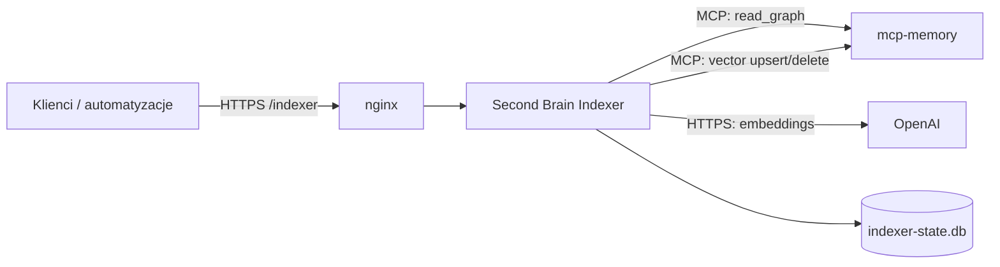
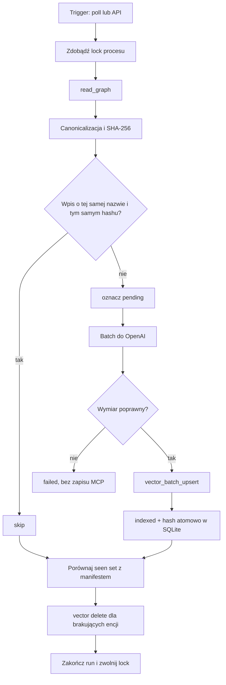

# Second Brain Indexer - specyfikacja techniczna v0.1

**Status:** propozycja do akceptacji  
**Data:** 2026-09-04  
**Zakres:** indeksowanie embeddingów encji przechowywanych przez `mcp-memory`; bez implementacji.

**Realizacja:** szczegółowy projekt modułów, zmierzony kontrakt MCP i ograniczenia V1 są w [low-level design v0.1](./second-brain-indexer-low-level-design-v0.1.md). V1 używa nazw encji jako tożsamości i nie realizuje reindeksacji generacyjnej.

> **Decyzja zastępująca (2026-09-04):** każde dalsze odniesienie w tej wersji do stabilnego `entity_id`, `index_generation`, aktywnej generacji, automatycznego `reindexRequired` albo wymiaru 1536 jest zastąpione przez ograniczony kontrakt V1: `entity_name` jest jedynym kluczem i adresem wektora, vector store ma jeden wymiar sprawdzany na starcie (obecnie 384), a zmiana modelu/wymiaru jest zewnętrzną operacją utrzymaniową `mcp-memory`. Szczegóły i sprawdzony wynik T0 są w LLD.

## 1. Cel i decyzje

Second Brain Indexer jest małym, niezależnym procesem Rust działającym obok `mcp-memory`. Utrzymuje aktualność wektorów encji poprzez okresowy skan grafu albo jawnie wywołany selektor. W pierwszej wersji nie wymaga forka `mcp-memory`, webhooków ani drugiego serwera MCP.

Przyjęte decyzje:

- polling jest domyślnie wykonywany co 15 minut;
- jedna encja odpowiada jednemu embeddingowi, obejmującemu jej dane, obserwacje i relacje;
- zmiana jest wykrywana przez SHA-256 deterministycznej canonical representation;
- manifest jest lokalnym stanem SQLite (`indexer-state.db`), nigdy encją ani obserwacją Second Brain;
- tożsamością encji jest jej unikalna, wrażliwa na wielkość liter `name` z `mcp-memory`;
- model i wymiar muszą odpowiadać jedynemu vector store `mcp-memory` (na docelowej instancji: 384); indexer odrzuca niezgodną konfigurację;
- masowy zapis używa `vector_batch_upsert`, a pojedynczy `vector_upsert_embedding`; zapis jest zawsze przez MCP, nigdy przez bezpośredni zapis do pliku `.mcpmem`;
- API V1 ma wyłącznie selektory `full`, `entity` i `entityType`.

## 2. Granice odpowiedzialności

| Komponent | Odpowiedzialność | Poza zakresem |
|---|---|---|
| `mcp-memory` | źródło wiedzy: graf, encje, obserwacje i relacje; przechowuje wektory przez swoje API | wyliczanie embeddingów, harmonogram, śledzenie aktualności treści |
| Second Brain Indexer | odczyt grafu, canonicalizacja, hash, plan indeksowania, stan, wywołania OpenAI i MCP, HTTP API | własność danych wiedzy oraz bezpośrednia migracja bazy `mcp-memory` |
| OpenAI | zwraca embedding dla dostarczonego tekstu | przechowywanie grafu, decyzja co indeksować, stan indeksu |
| nginx | TLS, reverse proxy i opcjonalne ograniczenie dostępu do API indexera | logika indeksowania |



## 3. Założenia i kontrakt integracyjny

Indexer łączy się z uruchomionym serwerem MCP przez skonfigurowany transport MCP. Dokładny transport - stdio, Streamable HTTP albo inny wspierany przez wdrożoną wersję - jest parametrem wdrożenia, nie częścią HTTP API indexera.

Przed implementacją należy potwierdzić na docelowej instancji nazwy, limity i formaty narzędzi. Spec zakłada dostępność co najmniej:

- `read_graph` do pobrania aktualnego grafu;
- `vector_batch_upsert` do zapisu grupy embeddingów;
- `vector_upsert_embedding` do zapisu pojedynczego embeddingu;
- operacji usunięcia embeddingu, nazwanej tutaj **vector delete**. Jeżeli wdrożona wersja nie udostępnia `vector_delete_embedding`, usunięcie encji jest oznaczane lokalnie jako `delete_pending`, alarmowane i wymaga dodania kompatybilnej operacji do adaptera MCP. Indexer nie usuwa rekordów bezpośrednio z pliku bazy.

Wymiar zwróconego wektora musi być równy `embedding.dimensions`; każda niezgodność przerywa daną partię przed zapisem do MCP.

## 4. Canonical representation

Canonical representation jest jedynym wejściem do hasha i embeddingu. Ma deterministycznie opisywać to, co wiadomo o encji, bez metadanych wykonawczych.

### 4.1 Reguły V1

1. Kluczem encji jest dokładna nazwa z `mcp-memory`. Serwer gwarantuje jej unikalność i rozróżnia wielkość liter; nazwa jest także adresem embeddingu.
2. Tekst jest UTF-8, zakończony pojedynczym `\n`; normalizacja Unicode: NFC; nowe linie: `\n`.
3. Pola, obserwacje i relacje są sortowane stabilnie po znormalizowanych wartościach. Puste elementy są pomijane.
4. Obserwacje są deduplikowane po znormalizowanej treści.
5. Relacja ma postać kierunkową: `outgoing | <typ> | <cel: typ>: <cel: nazwa>` lub `incoming | ...`. Sortowanie obejmuje kierunek, typ i znormalizowaną nazwę celu.
6. Nie dodaje się `indexed_at`, hashy, błędów, identyfikatorów jobów ani danych manifestu.
7. Tekst ponad skonfigurowanym limitem jest skracany deterministycznie na granicy UTF-8 z dopiskiem `\n[truncated]`; limit wchodzi do wersji reprezentacji.
8. Każda wartość interpolowana w representation (typ, nazwa, obserwacja i typ/nazwa relacji) jest po normalizacji kodowana jako JSON string. Zapobiega to kolizjom przez nowe linie, `-` i `|`; wartość nie jest trimowana ani case-foldowana.

Przykład:

```text
representation: "entity-v1"
entity_type: "Projekt"
entity_name: "Second Brain"

observations:
- "Prowadzony przez Artura."
- "Wykorzystuje mcp-memory."

relations:
- incoming | "prowadzi" | "Osoba": "Artur"
- outgoing | "wykorzystuje" | "Technologia": "mcp-memory"
```

`content_hash = SHA-256(canonical_representation_bytes)`, kodowany heksadecymalnie małymi literami.

### 4.2 Wersjonowanie

Efektywny fingerprint konfiguracji to:

```text
taxonomy_version | representation_version | embedding_model | dimensions
```

Indexer utrzymuje jeden współdzielony vector store i nie tworzy generacji ani namespace'ów. Zmiana modelu lub wymiaru jest operacją utrzymaniową właściciela `mcp-memory`: najpierw przygotowuje on vector store, potem aktualizuje się konfigurację indexera i uruchamia pełny skan. Przy niezgodnym fingerprintcie indexer jest `not ready` i nie zapisuje wektorów.

`taxonomy_version` jest ustawiane jawnie w konfiguracji przez właściciela Second Brain. Indexer nie zgaduje jego wartości ani nie wprowadza nowych typów.

## 5. Model danych: `indexer-state.db`

SQLite jest prywatnym stanem indexera. Zalecane PRAGMA: `journal_mode=WAL`, `foreign_keys=ON`, `busy_timeout=5000`. Baza ma uprawnienia katalogu `0700` i pliku `0600`.

```sql
CREATE TABLE schema_migrations (
  version INTEGER PRIMARY KEY,
  applied_at TEXT NOT NULL
);

CREATE TABLE index_configuration (
  singleton INTEGER PRIMARY KEY CHECK (singleton = 1),
  taxonomy_version TEXT NOT NULL,
  representation_version TEXT NOT NULL,
  embedding_model TEXT NOT NULL,
  dimensions INTEGER NOT NULL,
  verified_at TEXT NOT NULL
);

CREATE TABLE entity_index_state (
  entity_name TEXT NOT NULL,
  entity_type TEXT NOT NULL,
  content_hash TEXT NOT NULL,
  status TEXT NOT NULL CHECK (status IN ('indexed','pending','indexing','failed','delete_pending','deleted')),
  attempt_count INTEGER NOT NULL DEFAULT 0,
  last_indexed_at TEXT,
  last_seen_at TEXT NOT NULL,
  last_error_code TEXT,
  last_error_message TEXT,
  PRIMARY KEY (entity_name)
);

CREATE TABLE run (
  id TEXT PRIMARY KEY,
  trigger TEXT NOT NULL CHECK (trigger IN ('poll','api','fullscan','startup')),
  selector_json TEXT NOT NULL,
  status TEXT NOT NULL CHECK (status IN ('queued','running','succeeded','partial','failed','cancelled')),
  requested_at TEXT NOT NULL,
  started_at TEXT,
  finished_at TEXT,
  entities_seen INTEGER NOT NULL DEFAULT 0,
  entities_indexed INTEGER NOT NULL DEFAULT 0,
  entities_skipped INTEGER NOT NULL DEFAULT 0,
  entities_deleted INTEGER NOT NULL DEFAULT 0,
  entities_failed INTEGER NOT NULL DEFAULT 0,
  error_summary TEXT
);

CREATE TABLE idempotency_key (
  key TEXT PRIMARY KEY,
  request_hash TEXT NOT NULL,
  run_id TEXT NOT NULL REFERENCES run(id),
  response_status INTEGER NOT NULL,
  response_body_json TEXT NOT NULL,
  expires_at TEXT NOT NULL
);
```

Nie zapisuje się w SQLite klucza OpenAI ani pełnych embeddingów. Dopuszczalne jest przechowywanie nazw i błędów operacyjnych, ponieważ są potrzebne do diagnostyki.

## 6. Przepływy indeksowania

### 6.1 Skan inkrementalny



Polling uruchamia `full` jako skan grafu i diff hashy - nie jako ponowną wektoryzację całej bazy. Encje nieobecne w wyniku `read_graph` są kandydatami do usunięcia wyłącznie, gdy adapter ma jawną, serwerową gwarancję kompletnego odczytu `full`; przy odczycie częściowym, braku takiej gwarancji lub błędzie nie usuwa niczego, ale nadal może bezpiecznie wykonać upserty odczytanych encji. Selektory `entity` i `entityType` nigdy nie usuwają.

### 6.2 Nowe, zmienione i usunięte encje

| Stan grafu | Stan manifestu | Działanie |
|---|---|---|
| nowa encja | brak wpisu | embedding i upsert |
| istniejąca, hash inny | wpis `indexed` | embedding i upsert, potem aktualizacja hash |
| istniejąca, hash ten sam | zgodny wpis | skip |
| encja zniknęła podczas `full` | wpis aktywny | vector delete, potem `deleted` |
| encja zniknęła po odczycie, przed upsertem | błąd/zapis odrzucony | kolejny skan potwierdza brak i wykonuje delete |

### 6.3 Fullscan i selektor

`fullscan` wymusza skan całego grafu oraz, tylko po potwierdzeniu kompletności, obsługę usunięć. Nadal respektuje hashe - nie wymusza kosztownego re-embeddingu bez zmiany. `force=true` jest poza V1; zmiana modelu lub wymiaru wymaga zewnętrznej operacji utrzymaniowej vector store zgodnie z sekcją 4.2.

## 7. HTTP API V1

Wszystkie endpointy są prefiksowane przez `/indexer`. Odpowiedzi są JSON, daty to RFC 3339 UTC, a identyfikator run to UUID. Nginx może dodać uwierzytelnienie przed przekazaniem żądania.

### 7.1 Selektor

Selektor jest sumą rozłączną. Dokładnie jedno pole jest wymagane:

```json
{ "full": true }
```

```json
{ "entity": { "name": "Second Brain" } }
```

```json
{ "entityType": "Projekt" }
```

W V1 `entity` przyjmuje wyłącznie dokładną, wrażliwą na wielkość liter `name`, ponieważ jest to jednoznaczny klucz serwera. `entityType` musi dokładnie odpowiadać typowi z grafu. API nie interpretuje filtrów, wyrażeń ani częściowych nazw.

### 7.2 Endpointy

| Metoda i ścieżka | Znaczenie | Kody |
|---|---|---|
| `GET /indexer/status` | gotowość procesu, lock, aktywna generacja, ostatni run | 200, 503 |
| `GET /indexer/stats` | agregaty stanu i liczniki | 200 |
| `POST /indexer/index` | asynchronicznie kolejkuje indeksowanie selektora | 202, 400, 409, 422, 503 |
| `POST /indexer/fullscan` | skrót dla `POST /indexer/index` z `{ "selector": { "full": true } }` | 202, 409, 503 |
| `GET /indexer/runs/{runId}` | status konkretnego przebiegu | 200, 404 |
| `GET /indexer/metrics` | metryki Prometheus, opcjonalnie tylko prywatnie | 200 |

Żądanie indeksowania:

```json
{
  "selector": { "entityType": "Projekt" }
}
```

Nagłówek `Idempotency-Key` jest opcjonalny dla wywołań ręcznych i wymagany dla automatyzacji. Ten sam klucz oraz identyczne body zwracają zapamiętaną odpowiedź; ten sam klucz i inne body zwracają `409 idempotency_key_reused`. Retencja klucza: konfigurowalne 24 h.

Odpowiedź `202`:

```json
{
  "runId": "fa9b6cf7-18a4-4d93-94e3-9a30c6e5fcac",
  "status": "queued",
  "selector": { "entityType": "Projekt" },
  "requestedAt": "2026-09-04T12:00:00Z"
}
```

Przykładowe `GET /status`:

```json
{
  "ready": true,
  "version": "0.1.0",
  "activeGeneration": {
    "taxonomyVersion": "1.0",
    "representationVersion": "entity-v1",
    "embeddingModel": "text-embedding-3-small",
    "dimensions": 384
  },
  "polling": { "enabled": true, "intervalSeconds": 900, "nextRunAt": "2026-09-04T12:15:00Z" },
  "run": { "inProgress": false, "lastRunId": "...", "lastRunStatus": "succeeded" }
}
```

`GET /stats` zawiera liczbę wpisów per status, czas ostatniego udanego przebiegu, liczbę zmian w ostatnim przebiegu, sumy błędów per kod oraz wskaźnik zaległych `delete_pending`.

### 7.3 Semantyka błędów

- `400`: niepoprawny JSON lub niepoprawna postać selektora;
- `409`: uruchomienie koliduje z polityką kolejki albo konflikt idempotency key;
- `422`: prawidłowy JSON, ale `entityType` lub identyfikator nie istnieje w aktualnym grafie;
- `503`: process niegotowy, baza state zablokowana, MCP lub OpenAI niedostępne przed przyjęciem zadania;
- `202`: zadanie przyjęte. Sukces końcowy jest sprawdzany przez `/runs/{runId}`.

## 8. Retry, błędy i idempotencja

Klasyfikacja błędów:

| Klasa | Przykłady | Zachowanie |
|---|---|---|
| przejściowy | timeout, 429, 5xx OpenAI/MCP, zerwane połączenie | retry z exponential backoff i pełnym jitterem |
| trwały | 401/403 OpenAI, błędny wymiar, nieprawidłowy request MCP | bez automatycznego retry; wpis `failed`, alarm |
| częściowy | część partii odrzucona | izolacja do mniejszych partii, zapis sukcesów, fail tylko wadliwych encji |
| niespójność | upsert MCP powiódł się, SQLite nie zapisał stanu | następny przebieg powtarza idempotentny upsert |

Domyślnie: maksymalnie 5 prób na wywołanie z opóźnieniem bazowym 500 ms, limitem 30 s i pełnym jitterem. Limit retry dla encji w jednym runie jest oddzielny od przyszłych przebiegów. Wykładniczy retry nigdy nie wstrzymuje serwera HTTP - jest wykonywany w workerze.

Kolejność zapisu zapewnia bezpieczeństwo przy awarii: najpierw OpenAI, następnie upsert/delete MCP, na końcu transakcja SQLite aktualizująca hash/status. Powtórzony upsert tej samej dokładnej nazwy encji i tego samego wektora jest oczekiwany i musi być bezpieczny.

## 9. Współbieżność, blokady i shutdown

Proces ma jeden globalny executor indeksowania w V1. API przyjmuje zadania do trwałej kolejki w SQLite; domyślna polityka jest `coalesce`:

- aktywny lub oczekujący `full` pochłania późniejsze `full`;
- `entity` i `entityType` są łączone, gdy nie poszerza to semantyki poza ich sumę;
- gdy nie można bezpiecznie połączyć zadań, odpowiedź to `409 run_in_progress` zamiast równoległego wyścigu.

Na start procesu jest zakładany blokujący lock pliku obok `indexer-state.db`. Druga instancja kończy pracę z kodem błędu. SQLite zapewnia dodatkową ochronę transakcyjną, ale nie zastępuje locka procesu.

Po SIGTERM/SIGINT:

1. serwer przestaje przyjmować nowe `POST` i zwraca `503 shutting_down`;
2. scheduler nie zaczyna nowego runu;
3. bieżąca partia ma konfigurowalny czas na zakończenie;
4. niedokończone wpisy `indexing` wracają przy kolejnym starcie do `pending`;
5. proces zapisuje końcowy stan i zwalnia lock.

## 10. Konfiguracja

Konfiguracja jest plikiem TOML, np. `/etc/second-brain-indexer/config.toml`. Sekrety są poza nim.

```toml
[server]
bind = "127.0.0.1:9184"
request_timeout_seconds = 10

[polling]
enabled = true
interval_seconds = 900
run_on_start = false

[state]
database_path = "/var/lib/second-brain-indexer/indexer-state.db"
lock_path = "/var/lib/second-brain-indexer/indexer.lock"

[mcp]
transport = "streamable-http"
endpoint = "http://127.0.0.1:9183/mcp"
request_timeout_seconds = 30
batch_size = 128
bearer_token_env = "MCP_MEMORY_TOKEN"

[embedding]
model = "<model-zgodny-z-vector-store>"
dimensions = 384
max_input_chars = 24000
max_input_tokens = 8192
openai_base_url = "https://api.openai.com/v1"
api_key_env = "OPENAI_API_KEY"

[representation]
version = "entity-v1"
taxonomy_version = "1.0"

[retry]
max_attempts = 5
base_delay_ms = 500
max_delay_ms = 30000

[api]
idempotency_ttl_hours = 24
```

Walidacja startowa odrzuca `dimensions <= 0`, zbyt duże batch size, niepoprawne URL i pustą wersję reprezentacji/taksonomii. Przy starcie indexer porównuje skonfigurowany wymiar z MCP i nie uruchamia się przy niezgodności. Zmiana fingerprintu wymaga skoordynowanej zewnętrznej operacji utrzymaniowej, bo V1 nie ma generacji wektorów.

## 11. Bezpieczeństwo

- Klucz jest przekazywany wyłącznie przez `OPENAI_API_KEY` pobierany przez systemd `EnvironmentFile`, odczytywanym przez użytkownika usługi (`0600`). Nie występuje w TOML, bazie, logach, HTTP ani odpowiedziach błędów.
- Indexer nasłuchuje na `127.0.0.1`; publiczne wystawienie odbywa się wyłącznie przez nginx z TLS.
- Endpointy mutujące są chronione co najmniej przez Basic Auth lub, preferencyjnie, przez mTLS / auth proxy. `/metrics` powinno pozostać prywatne albo mieć osobną kontrolę dostępu.
- Limity rozmiaru body, rate limit nginx oraz timeouts chronią API przed przypadkowym zalaniem przez automatyzacje.
- Logi maskują `Authorization`, `OPENAI_API_KEY`, treść embeddingów i pełne observation text. Dopuszczalne są dokładne nazwy encji, typ, długość tekstu, hash skrócony do 12 znaków i kod błędu.
- Uprawnienia: oddzielny systemowy użytkownik `second-brain-indexer`, bez shell loginu i bez dostępu zapisu do bazy `mcp-memory`.

## 12. Logging i metryki

Logi są strukturalne (JSON) i kierowane do `journald`. Każdy wpis wykonawczy zawiera `run_id`, `selector_kind`, a dla encji - dokładną nazwę, `entity_type`, `attempt` i wynik; nie zawiera observation text ani sekretów.

Metryki Prometheus:

- `second_brain_indexer_runs_total{trigger,status}`;
- `second_brain_indexer_entities_total{action}` gdzie action to `indexed`, `skipped`, `deleted`, `failed`;
- `second_brain_indexer_run_duration_seconds`;
- `second_brain_indexer_embedding_requests_total{result}` i `..._duration_seconds`;
- `second_brain_indexer_mcp_requests_total{operation,result}`;
- `second_brain_indexer_pending_entities`;
- `second_brain_indexer_last_success_unixtime`;

Alerty operacyjne: brak udanego pollingu przez 2 interwały, `delete_pending > 0`, powtarzające się błędy autoryzacji i rosnący backlog.

## 13. Wdrożenie: systemd i nginx

Przykład `/etc/systemd/system/second-brain-indexer.service`:

```ini
[Unit]
Description=Second Brain Indexer
After=network-online.target
Wants=network-online.target

[Service]
Type=simple
User=second-brain-indexer
Group=second-brain-indexer
ExecStart=/usr/local/bin/second-brain-indexer --config /etc/second-brain-indexer/config.toml
EnvironmentFile=/etc/second-brain-indexer/secrets.env
Restart=on-failure
RestartSec=5
StateDirectory=second-brain-indexer
NoNewPrivileges=true
PrivateTmp=true
ProtectSystem=strict
ProtectHome=true
ReadWritePaths=/var/lib/second-brain-indexer

[Install]
WantedBy=multi-user.target
```

Systemd uruchamia stale działający proces - polling jest jego wewnętrznym schedulerem, a nie osobnym timerem. Dzięki temu status i kolejka są spójne.

Przykład fragmentu nginx:

```nginx
location /indexer/ {
    proxy_pass http://127.0.0.1:9184;
    proxy_http_version 1.1;
    proxy_set_header Host $host;
    proxy_set_header X-Real-IP $remote_addr;
    proxy_set_header X-Forwarded-For $proxy_add_x_forwarded_for;
    proxy_set_header X-Forwarded-Proto $scheme;
    client_max_body_size 32k;
    proxy_connect_timeout 5s;
    proxy_read_timeout 15s;
    limit_req zone=indexer_api burst=20 nodelay;
    # auth_request /internal/indexer-auth;  # przykład: auth proxy
}
```

Konfiguracja produkcyjna musi dodać certyfikat TLS i rzeczywisty mechanizm autoryzacji. Lokalny health check nginx może kierować do `GET /indexer/status`.

## 14. Kryteria akceptacji

1. Po czystym starcie i `POST /indexer/fullscan` każda encja z grafu ma jeden embedding o skonfigurowanym, zgodnym z MCP wymiarze (na docelowej instancji: 384), a run kończy się `succeeded`.
2. Drugi fullscan bez zmiany danych nie wywołuje requestu embeddingowego ani upsertu; licznik `skipped` odpowiada liczbie encji.
3. Zmiana obserwacji lub relacji jednej encji powoduje embedding i upsert wyłącznie tej encji.
4. Nowa encja jest indeksowana w pierwszym kolejnym pollingu lub po celowanym triggerze.
5. Usunięcie encji jest wykrywane tylko przez `full`; jej embedding jest usunięty przez API MCP, a manifest zmienia status na `deleted`.
6. `entity` i `entityType` nie powodują usunięć obiektów poza ich wynikiem. Nieobsługiwany selektor zwraca `400`.
7. Identyczne żądanie z tym samym `Idempotency-Key` nie tworzy kolejnego runu; konflikt body zwraca `409`.
8. Przy 429 OpenAI indexer retryuje zgodnie z konfiguracją; przy błędzie 401 nie retryuje w pętli i raportuje błąd bez ujawnienia sekretu.
9. Wymiar inny niż skonfigurowany nie trafia do MCP.
10. Równoległe wywołania nie powodują dwóch aktywnych workerów; po restarcie wpisy `indexing` są bezpiecznie odzyskiwane.
11. SIGTERM kończy proces bez uszkodzenia SQLite; po restarcie kolejny run doprowadza indeks do spójności.
12. `GET /status`, `/stats`, `/runs/{id}` i `/metrics` zwracają informacje bez sekretów i są dostępne przez nginx na ścieżce innej niż API `mcp-memory`.

## 15. Plan implementacji

1. **Discovery i kontrakty.** Potwierdzić wersję oraz transport `mcp-memory`, schemat `read_graph`, dokładne nazwy/limity narzędzi vector i semantykę delete. Ustalić docelowe identyfikatory encji.
2. **Szkielet procesu.** Rust: konfiguracja, `axum`, klient MCP, klient OpenAI, SQLite migracje, pojedynczy lock i health endpoint.
3. **Canonicalizer.** Zaimplementować `entity-v1`, testy deterministyczności, Unicode, sortowania, deduplikacji i limitu długości. Zatwierdzić przykłady z realnego grafu.
4. **State i planner.** Dodać generacje, diff hashy, kolejkę runów, idempotency keys oraz recovery po crashu.
5. **Pipeline embeddingów.** Batching, walidacja długości wektora, upsert, delete adapter, retry i izolowanie wadliwych partii.
6. **HTTP i observability.** Wdrożyć API V1, structured logs, metrics i testy kontraktowe.
7. **Integracja operacyjna.** Dodać unit systemd, nginx, sekrety, uprawnienia, alerty i runbook.
8. **Walidacja jakości.** Indeks inicjalny, zestaw rzeczywistych pytań przez `hybrid_search`, pomiar jakości oraz korekta `entity-v1` wyłącznie przez nową wersję reprezentacji.

## 16. Celowo poza zakresem v0.1

- webhooki w `mcp-memory` lub fork serwera;
- drugi serwer MCP dla indexera;
- złożony język selektorów, filtrowanie po treści obserwacji i bulk query;
- embedding per relacja, chunkowanie jednej encji do wielu wektorów;
- bezpośredni dostęp SQL do bazy `mcp-memory`;
- automatyczna zmiana taksonomii;
- wieloprocesowe, rozproszone przetwarzanie.

Te elementy można dodać później, gdy dane operacyjne pokażą realną potrzebę. V0.1 ma być celowo mała, przewidywalna i odporna na powtórzenia - bez budowania rakiety do podlewania paprotki.
